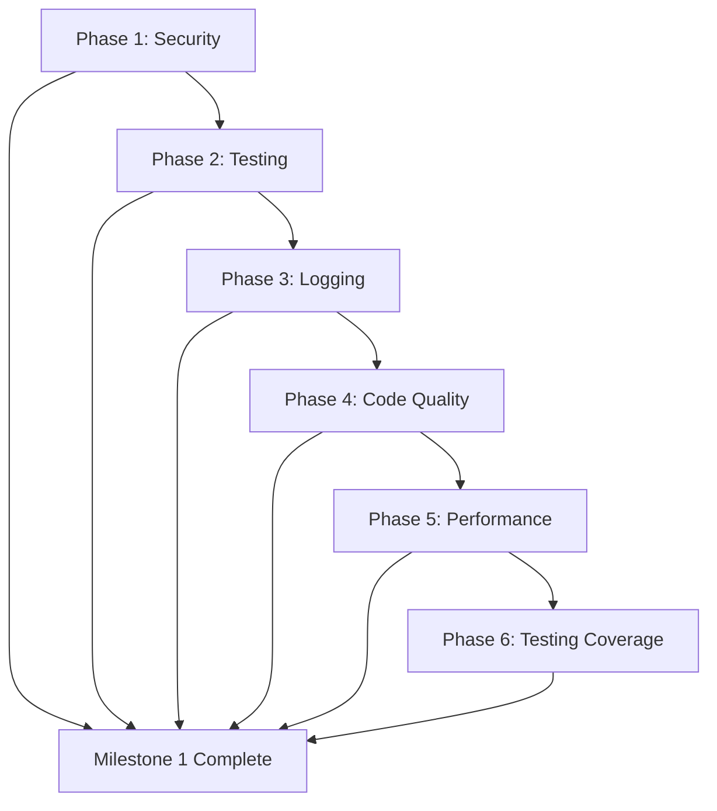

# GADB Quality Improvement Roadmap

**Created**: 2026-01-14
**Current Milestone**: Quality & Security Foundation
**Status**: Ready to Execute

---

## Milestone 1: Quality & Security Foundation

**Goal**: Eliminate critical security vulnerabilities and establish quality baseline
**Duration**: 2-3 weeks
**Success Criteria**: Zero critical security issues, 80% service layer test coverage, proper logging throughout

---

### Phase 1: Critical Security Remediation 🚨

**Priority**: CRITICAL
**Dependencies**: None
**Duration**: 3-5 days

**Objectives:**
- Remove committed secrets from git history
- Rotate all exposed credentials
- Implement API rate limiting
- Force admin password change mechanism

**Deliverables:**
1. All .env files removed from git history and .gitignore verified
2. All credentials rotated (POSTGRES_PASSWORD, REDIS_PASSWORD, SECRET_KEY)
3. Pre-commit hook installed to prevent future secret commits
4. Rate limiting implemented with slowapi:
   - Authentication endpoints: 5 req/min
   - Read endpoints: 100 req/min
   - Write endpoints: 20 req/min
5. Admin password change forced on first login with default password rejection
6. Security validation tests added

**Files to Modify:**
- `.gitignore` - Verify .env exclusions
- `backend/app/main.py` - Add rate limiting middleware
- `backend/app/api/auth.py` - Add password change enforcement
- `backend/requirements.txt` - Add slowapi dependency
- `backend/scripts/init_database.sh` - Generate random admin password
- `.git/` - History rewrite with git-filter-repo or BFG

**Success Criteria:**
- ✅ No secrets in git history (verified with `git log --all --full-history -- "*.env"`)
- ✅ All endpoints return rate limit headers (X-RateLimit-Limit, X-RateLimit-Remaining)
- ✅ Admin login with default password redirects to password change page
- ✅ New admin password rejects default value

---

### Phase 2: Service Layer Testing 🧪

**Priority**: HIGH
**Dependencies**: None
**Duration**: 4-6 days

**Objectives:**
- Achieve 80%+ test coverage for all service classes
- Test all Celery background tasks with mocked dependencies
- Validate error handling and edge cases

**Deliverables:**

1. **Incident Service Tests** (`backend/tests/test_services/test_incident_service.py`)
   - Test create, read, update, delete operations
   - Test search and filtering logic
   - Test relationship management (actors, sources, categories)
   - Test validation and error handling

2. **Actor Service Tests** (`backend/tests/test_services/test_actor_service.py`)
   - Test CRUD operations
   - Test search by name, type, jurisdiction
   - Test incident association logic

3. **Category Service Tests** (`backend/tests/test_services/test_category_service.py`)
   - Test hierarchical category operations
   - Test parent-child relationships
   - Test category validation

4. **RSS Ingester Tests** (`backend/tests/test_services/test_rss_ingester.py`)
   - Test feed parsing with sample RSS XML
   - Test error handling for malformed feeds
   - Test deduplication logic
   - Mock feedparser and requests

5. **YouTube Ingester Tests** (`backend/tests/test_services/test_youtube_ingester.py`)
   - Test transcript extraction with sample data
   - Test error handling for unavailable videos
   - Mock youtube-transcript-api

6. **PDF Processor Tests** (`backend/tests/test_services/test_pdf_processor.py`)
   - Test text extraction from sample PDFs
   - Test OCR fallback for image-based PDFs
   - Test error handling for corrupted files
   - Mock PyPDF2, pdfplumber, pytesseract

7. **Celery Tasks Tests** (`backend/tests/test_tasks/test_ingestion_tasks.py`)
   - Test ingest_rss_feed task logic
   - Test ingest_all_feeds batch processing
   - Test cleanup_old_queue_items logic
   - Mock Celery app and database session

**Files to Create:**
- `backend/tests/test_services/` directory
- `backend/tests/test_tasks/` directory
- 7 new test files (approximately 100-150 tests total)

**Success Criteria:**
- ✅ Service layer coverage ≥80% (measured with pytest --cov)
- ✅ All service methods have test cases
- ✅ All Celery tasks have test cases with mocked dependencies
- ✅ Tests pass in CI/CD pipeline

---

### Phase 3: Logging & Error Handling Improvements 📊

**Priority**: HIGH
**Dependencies**: Phase 2 (tests will catch logging-related bugs)
**Duration**: 2-3 days

**Objectives:**
- Replace all print() statements with proper logging
- Fix bare exception handling
- Add user-facing error states in frontend

**Deliverables:**

1. **Backend Logging Migration**
   - Replace print() in `backend/app/services/pdf_processor.py` (lines 49, 78, 176)
   - Replace print() in `backend/app/services/youtube_ingester.py` (line 48)
   - Replace print() in `backend/app/services/rss_ingester.py` (lines 64, 150)
   - Use appropriate log levels: logger.error(), logger.warning(), logger.info(), logger.debug()
   - Add contextual information to all log messages (task IDs, file paths, error details)

2. **Exception Handling Improvements**
   - Fix bare `except:` in `backend/app/services/rss_ingester.py:78-79`
   - Replace with specific exception types: `except (TypeError, ValueError, KeyError) as e:`
   - Log all caught exceptions with full traceback
   - Add exception context for debugging

3. **Frontend Error States**
   - Add error state to `frontend/src/components/Header.tsx:34`
   - Add error state to `frontend/src/pages/HomePage.tsx:22`
   - Add error state to `frontend/src/pages/UserManagement.tsx:36,60,75`
   - Add error state to `frontend/src/pages/IncidentListPage.tsx:44,55`
   - Add error state to `frontend/src/pages/AnalyticsDashboard.tsx:47`
   - Add error state to `frontend/src/pages/IncidentDetailPage.tsx:22`
   - Add error state to `frontend/src/pages/AdminDashboard.tsx:55`
   - Pattern: `const [error, setError] = useState<string | null>(null); catch (error) { setError('User-friendly message'); console.error(error); }`

**Files to Modify:**
- `backend/app/services/pdf_processor.py`
- `backend/app/services/youtube_ingester.py`
- `backend/app/services/rss_ingester.py`
- 7 frontend component files

**Success Criteria:**
- ✅ Zero print() statements in backend code (verified with `grep -r "print(" backend/app/`)
- ✅ Zero bare except clauses (verified with `grep -r "except:" backend/app/`)
- ✅ All major frontend components display user-facing errors
- ✅ Log messages include sufficient context for debugging

---

### Phase 4: Code Quality Improvements 🧹

**Priority**: MEDIUM
**Dependencies**: Phase 1, 2, 3 (foundation must be solid first)
**Duration**: 3-4 days

**Objectives:**
- Refactor large files into smaller, maintainable components
- Extract duplicate code patterns into reusable utilities
- Make hardcoded values configurable

**Deliverables:**

1. **Frontend Component Refactoring**
   - Extract from `IncidentListPage.tsx` (439 lines → <250 lines):
     - `IncidentFilters.tsx` component
     - `IncidentCard.tsx` component
     - `IncidentList.tsx` component
   - Extract from `AddIngestionSource.tsx` (333 lines → <250 lines):
     - Form field components
     - Validation logic into utilities

2. **Backend Refactoring**
   - Extract from `backend/app/api/auth.py` (335 lines → <250 lines):
     - Separate admin endpoints into `backend/app/api/admin.py`
     - Extract password validation into `backend/app/utils/validation.py`

3. **Utility Extraction**
   - Create `backend/app/utils/db_helpers.py`:
     ```python
     def get_or_404(db: Session, model, **filters):
         """Get model instance or raise 404."""
         obj = db.query(model).filter_by(**filters).first()
         if not obj:
             raise HTTPException(status_code=404, detail=f"{model.__name__} not found")
         return obj
     ```
   - Use in all API endpoints to eliminate duplicate query patterns

4. **Configuration Improvements**
   - Make API URL configurable in `frontend/src/utils/api.ts`:
     ```typescript
     const API_URL = import.meta.env.VITE_API_URL || 'http://localhost:8000'
     ```
   - Remove hardcoded development IP from CORS origins in `backend/app/config.py:29-33`
   - Move to environment variable

**Files to Create:**
- `frontend/src/components/IncidentFilters.tsx`
- `frontend/src/components/IncidentCard.tsx`
- `frontend/src/components/IncidentList.tsx`
- `backend/app/api/admin.py`
- `backend/app/utils/validation.py`
- `backend/app/utils/db_helpers.py`

**Files to Modify:**
- `frontend/src/pages/IncidentListPage.tsx`
- `frontend/src/pages/AddIngestionSource.tsx`
- `backend/app/api/auth.py`
- `frontend/src/utils/api.ts`
- `backend/app/config.py`
- All API endpoints to use new db_helpers

**Success Criteria:**
- ✅ No files exceed 300 lines
- ✅ Duplicate query pattern eliminated (verified with grep)
- ✅ API URL configurable via VITE_API_URL environment variable
- ✅ No hardcoded IPs in CORS configuration

---

### Phase 5: Performance Optimization ⚡

**Priority**: MEDIUM
**Dependencies**: Phase 4 (clean code structure needed first)
**Duration**: 2-3 days

**Objectives:**
- Implement caching for frequently accessed data
- Prevent N+1 query problems
- Add pagination limits and database indexes

**Deliverables:**

1. **Eager Loading Implementation**
   - Add joinedload to incident queries in `backend/app/api/incidents.py`:
     ```python
     incidents = db.query(Incident).options(
         joinedload(Incident.category),
         joinedload(Incident.actors),
         joinedload(Incident.sources)
     ).filter(...).all()
     ```
   - Measure query reduction (should eliminate N+1 queries)

2. **Redis Caching**
   - Cache category list (rarely changes): 1 hour TTL
   - Cache analytics summary (moderate changes): 15 minute TTL
   - Cache actor list with search: 30 minute TTL
   - Add cache invalidation on create/update operations

3. **Pagination & Limits**
   - Add default max limit (100 items) to all paginated endpoints
   - Return 400 error if limit > 100 requested
   - Document pagination in API responses

4. **Database Indexes**
   - Add indexes to frequently filtered columns:
     - `incidents.date_occurred`
     - `incidents.severity`
     - `incidents.status`
     - `incidents.category_id`
     - `actors.name`
     - `actors.jurisdiction`

**Files to Modify:**
- `backend/app/api/incidents.py`
- `backend/app/api/categories.py`
- `backend/app/api/actors.py`
- `backend/app/api/analytics.py`
- `backend/alembic/versions/` (new migration for indexes)

**Success Criteria:**
- ✅ N+1 queries eliminated (verified with SQL query logging)
- ✅ Cache hit rate >70% for category/analytics endpoints
- ✅ All endpoints respect 100 item max limit
- ✅ Database indexes created and used (verified with EXPLAIN)

---

### Phase 6: Testing Coverage & E2E Completion 🎯

**Priority**: MEDIUM
**Dependencies**: Phase 1-5 (all features stable)
**Duration**: 3-4 days

**Objectives:**
- Increase overall backend coverage from 44% to 80%
- Complete E2E test implementation
- Add integration tests for ingestion workflows

**Deliverables:**

1. **Backend Coverage Expansion**
   - Add tests for untested API endpoints
   - Add tests for edge cases in existing services
   - Add tests for error paths and validation failures
   - Target: 80% overall backend coverage

2. **E2E Test Implementation**
   - Complete `frontend/e2e/dashboard.spec.ts`
   - Complete `frontend/e2e/analytics.spec.ts`
   - Complete `frontend/e2e/search-filter.spec.ts`
   - Complete `frontend/e2e/export.spec.ts`
   - Add `data-testid` attributes to components for reliable selection

3. **Integration Tests**
   - Test full RSS ingestion workflow (feed → queue → incident)
   - Test YouTube ingestion workflow (URL → transcript → queue)
   - Test PDF ingestion workflow (file → text → queue)
   - Test end-to-end authentication flow
   - Test incident creation with relationships

**Files to Modify:**
- `backend/tests/` (expand existing tests)
- `frontend/e2e/*.spec.ts` (complete all 32 test cases)
- Frontend components (add data-testid attributes)

**Success Criteria:**
- ✅ Backend coverage ≥80%
- ✅ All 32 E2E test cases implemented and passing
- ✅ Integration tests cover all ingestion workflows
- ✅ E2E tests run successfully in CI/CD

---

## Milestone 2: Advanced Features & Production Excellence

**Status**: Not Yet Planned
**Starts After**: Milestone 1 completion

**Future Phases:**
- Phase 7: Monitoring & Observability (Grafana, Sentry, alerting)
- Phase 8: Advanced Analytics (ML pattern detection, trend analysis)
- Phase 9: Public API (rate limiting tiers, API keys, documentation)
- Phase 10: Mobile Applications (iOS/Android native apps)
- Phase 11: Scalability Improvements (Elasticsearch, horizontal scaling)

---

## Phase Dependencies



**Critical Path**: Phase 1 → Phase 2 → Phase 3 → Phase 4 → Phase 5 → Phase 6

**Parallel Opportunities**:
- Phase 2 and Phase 1 can overlap (testing doesn't depend on security fixes)
- Phase 4 and Phase 5 can overlap partially (refactoring and performance work are independent)

---

## Success Metrics

### Milestone 1 Completion Criteria
- ✅ Zero critical security vulnerabilities (verified with security scan)
- ✅ Zero high-priority security vulnerabilities
- ✅ Backend test coverage ≥80%
- ✅ Service layer test coverage ≥80%
- ✅ All Celery tasks have tests
- ✅ Zero print() statements in production code
- ✅ Zero bare exception handlers
- ✅ All major frontend components have error states
- ✅ No files >300 lines
- ✅ N+1 queries eliminated
- ✅ Caching implemented with >70% hit rate
- ✅ All 32 E2E tests passing
- ✅ CI/CD pipeline green with all checks passing

### Quality Gates
Before moving to Milestone 2:
- [ ] All Phase 1-6 deliverables completed
- [ ] All success criteria met
- [ ] Security scan shows zero critical/high vulnerabilities
- [ ] Performance benchmarks meet targets (<2s page load, <200ms API response)
- [ ] Code review completed for all changes
- [ ] Documentation updated
- [ ] Deployment guide tested
- [ ] Production deployment successful

---

**Estimated Total Duration**: 17-25 days for Milestone 1
**Recommended Approach**: Execute phases sequentially with focus on quality over speed
**Next Action**: Begin Phase 1 (Critical Security Remediation)
